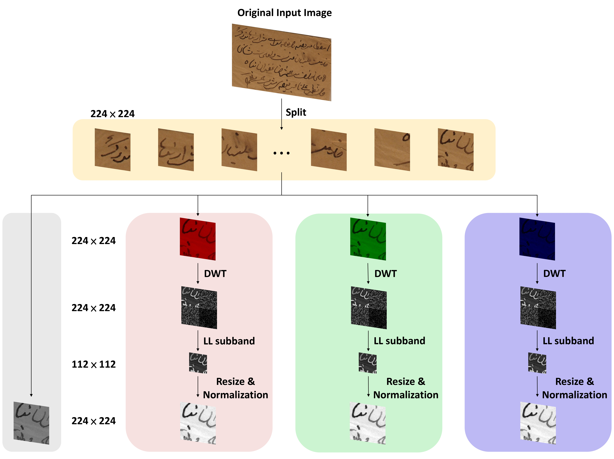
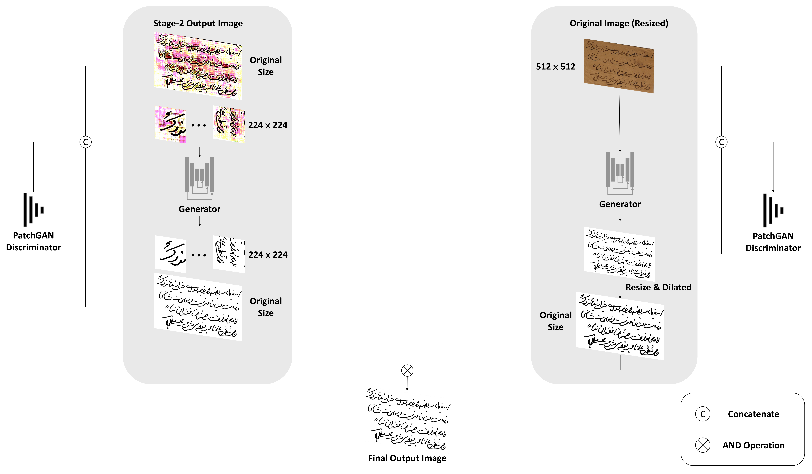

# Three-stage binarization of color document images based on discrete wavelet transform and generative adversarial networks

> [Three-stage binarization of color document images based on discrete wavelet transform and generative adversarial networks](https://arxiv.org/abs/2211.16098)

[](https://paperswithcode.com/sota/binarization-on-dibco-2013?p=three-stage-binarization-of-color-document)
[](https://paperswithcode.com/sota/binarization-on-h-dibco-2014?p=three-stage-binarization-of-color-document)
[](https://paperswithcode.com/sota/binarization-on-dibco-2017?p=three-stage-binarization-of-color-document)
[](https://paperswithcode.com/sota/binarization-on-h-dibco-2018?p=three-stage-binarization-of-color-document)

### Stage-1 Flowchart
<p align="center">
  
</p>

### Stage-2 Flowchart
<p align="center">
  
</p>

### Stage-3 Flowchart
<p align="center">
  
</p>

## Citation
If you find our paper useful in your research, please consider citing:

**Conference version (accepted by PRICAI 2023)**

    @inproceedings{ju2023ccdwt,
      title={CCDWT-GAN: Generative Adversarial Networks Based on Color Channel Using Discrete Wavelet Transform for Document Image Binarization},
      author={Ju, Rui-Yang and Lin, Yu-Shian and Chiang, Jen-Shiun and Chen, Chih-Chia and Chen, Wei-Han and Chien, Chun-Tse},
      booktitle={Pacific Rim International Conference on Artificial Intelligence},
      pages={186--198},
      year={2023},
      organization={Springer}
    }

**Journal version (under review):**

    @article{ju2022three,
      title={Three-stage binarization of color document images based on discrete wavelet transform and generative adversarial networks},
      author={Ju, Rui-Yang and Lin, Yu-Shian and Jin, Yanlin and Chen, Chih-Chia and Chien, Chun-Tse and Chiang, Jen-Shiun},
      journal={arXiv preprint arXiv:2211.16098},
      year={2022}
    }
   
## Requirements
* Linux (Ubuntu)
* Python >= 3.6 (Pytorch)
* NVIDIA GPU + CUDA CuDNN

## Installation
* Install [segmentation_models](https://github.com/qubvel/segmentation_models.pytorch)
```
    pip install segmentation-models-pytorch
```
* Install [pytesseract](https://github.com/madmaze/pytesseract)
```
    pip install pytesseract
```
* Download [tesseract data](https://github.com/tesseract-ocr/tessdata_best)
  
  For Conda users, you can create a new Conda environment using `conda env create -f environment.yaml`

## Dataset
You can download the dataset used in this experiment from [Dropbox](https://www.dropbox.com/scl/fi/rfqshevaq44g81lxkcjtt/Dataset.rar?rlkey=9z1hlrezkq9t99jv5hekuux71&dl=0).

## Usage
* Preprocess
  ```
    python3 image_to_224.py
    python3 image_to_512.py
  ```

* Train the model
  * Stage2
  ```
    python3 train_stage2.py
  ```
  * Before train left part of Stage3
  ```
    python3 predict_for_stage3.py
  ```
  * left part of Stage3 (need train predict_for_stage3.py first)
  ```
    python3 train_stage3.py
  ```
  * right part of Stage3 (independent training)
  ```
    python3 train_stage3_resize.py
  ```

* Evaluation the model
  ```
    python3 eval_stage3_all.py
  ```
