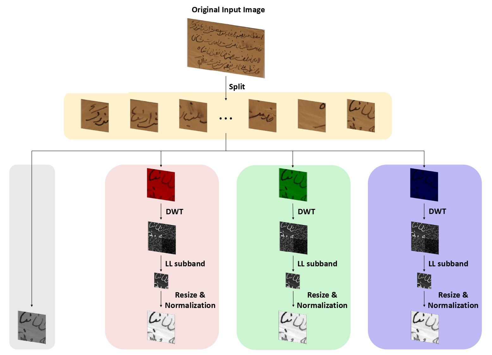
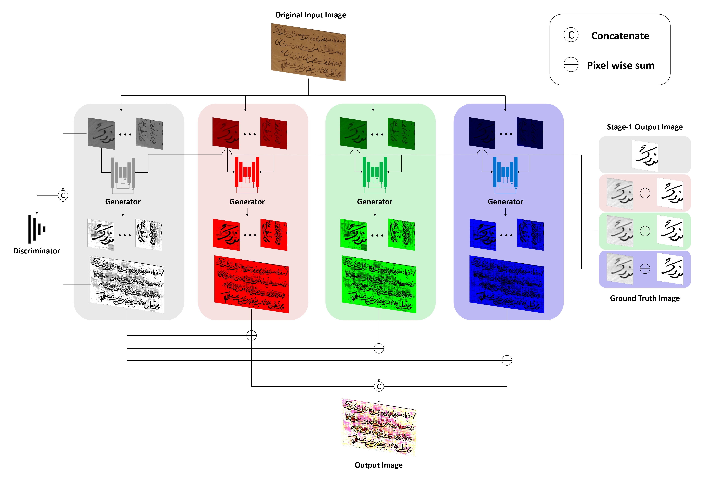
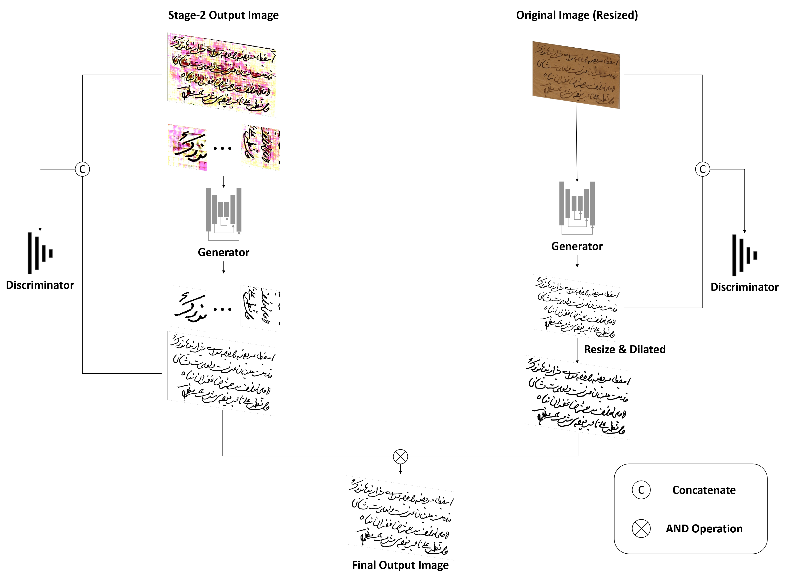
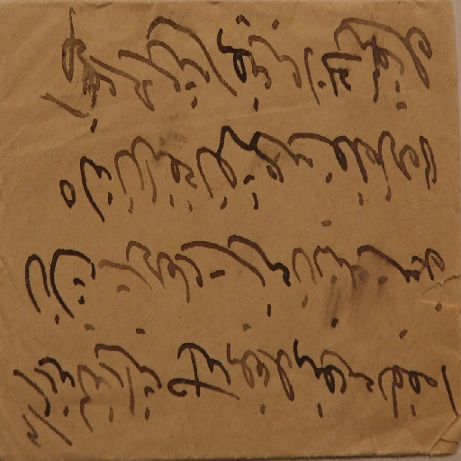
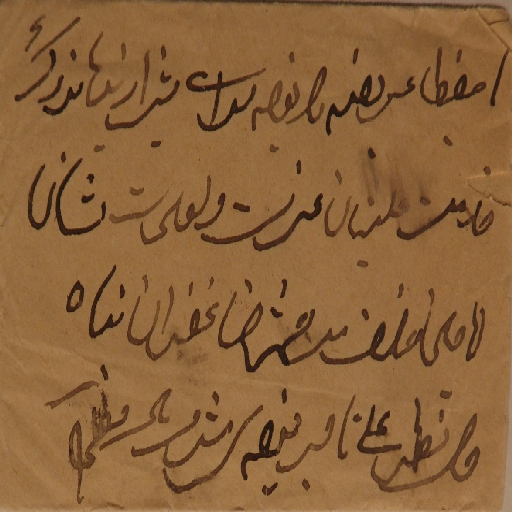
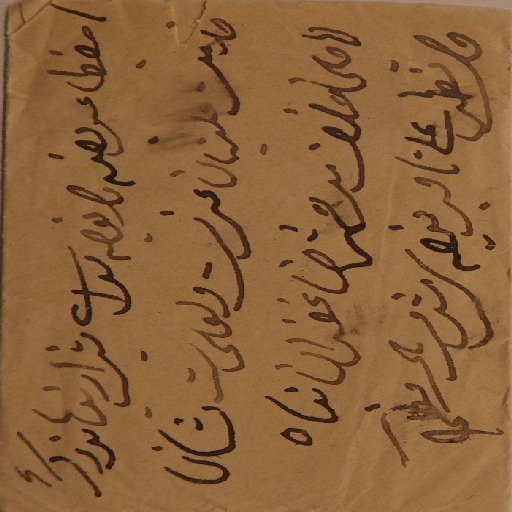
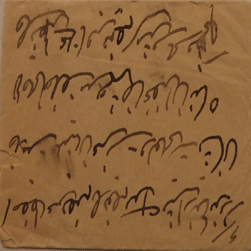
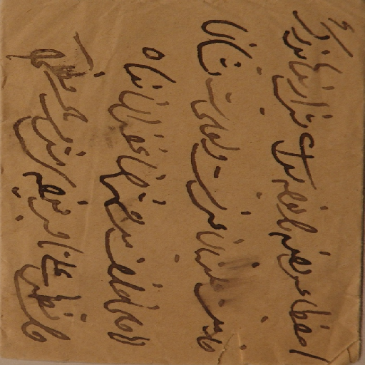
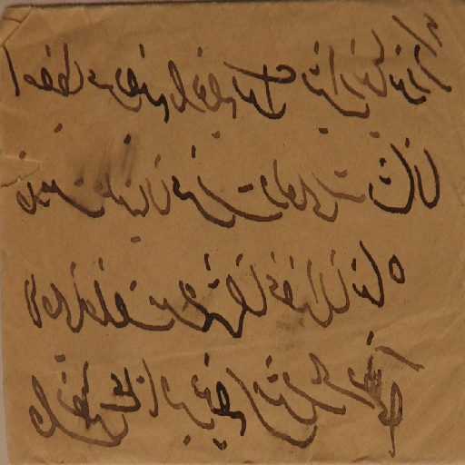
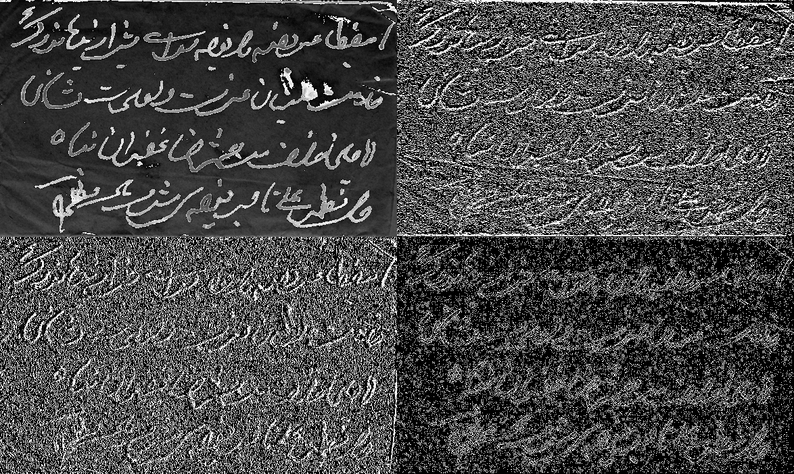

# Three-stage binarization of color document images based on discrete wavelet transform and generative adversarial networks

> [Three-stage binarization of color document images based on discrete wavelet transform and generative adversarial networks](https://arxiv.org/abs/2211.16098)

[](https://paperswithcode.com/sota/binarization-on-dibco-2013?p=three-stage-binarization-of-color-document)
[](https://paperswithcode.com/sota/binarization-on-h-dibco-2014?p=three-stage-binarization-of-color-document)
[](https://paperswithcode.com/sota/binarization-on-dibco-2017?p=three-stage-binarization-of-color-document)
[](https://paperswithcode.com/sota/binarization-on-h-dibco-2018?p=three-stage-binarization-of-color-document)

## Abstract
The efficient segmentation of foreground text information from the background in degraded color document images is a topic of concern. Due to the imperfect preservation of ancient documents over a long period of time, various types of degradation, including staining, yellowing, and ink seepage, have seriously affected the results of image binarization. In this paper, a three-stage method is proposed for image enhancement and binarization of degraded color document images by using discrete wavelet transform (DWT) and generative adversarial network (GAN). In Stage-1, we use DWT and retain the LL subband images to achieve the image enhancement. In Stage-2, the original input image is split into four (Red, Green, Blue and Gray) single-channel images, each of which trains the independent adversarial networks. The trained adversarial network models are used to extract the color foreground information from the images. In Stage-3, in order to combine global and local features, the output image from Stage-2 and the original input image are used to train the independent adversarial networks for document binarization. The experimental results demonstrate that our proposed method outperforms many classical and state-of-the-art (SOTA) methods on the Document Image Binarization Contest (DIBCO) dataset.

### Stage-1 Flowchart
<p align="center">
  
</p>

### Stage-2 Flowchart
<p align="center">
  
</p>

### Stage-3 Flowchart
<p align="center">
  
</p>

## Citation
If you find our paper useful in your research, please consider citing:

**Journal version (TCSVT under review):**

    @article{lin2022three,
      title={Three-stage binarization of color document images based on discrete wavelet transform and generative adversarial networks},
      author={Lin, Yu-Shian and Ju, Rui-Yang and Chen, Chih-Chia and Lin, Ting-Yu and Chiang, Jen-Shiun},
      journal={arXiv preprint arXiv:2211.16098},
      year={2022}
    }
   
## Requirements
* Linux (Ubuntu)
* Python >= 3.6 (Pytorch)
* NVIDIA GPU + CUDA CuDNN

## Installation
* Install [segmentation_models](https://github.com/qubvel/segmentation_models.pytorch)
```
    pip install segmentation-models-pytorch
```
* Install [pytesseract](https://github.com/madmaze/pytesseract)
```
    pip install pytesseract
```
* Download [tesseract data](https://github.com/tesseract-ocr/tessdata_best)
```
    conda env create -f environment.yml
```

## Dataset
You can download the dataset used in this experiment from [Dropbox](https://www.dropbox.com/scl/fi/kt1xgoh06evzlxkopj1mv/Document.rar?rlkey=k8ca1agvom9dx3yr11orvf3um&dl=0).
* Train: 
  
  DIBCO 2009, H-DIBCO 2010, H-DIBCO 2012, PHIBD, SMADI, Bickley Diary Dataset
  
* Test: 

  DIBCO 2011, DIBCO 2013, H-DIBCO 2014, H-DIBCO 2016, DIBCO 2017, H-DIBCO2018

## Usage
* Patch per datasets (Part of Stage1)

    Example: 512×512
<p align="center">






</p>

```
    python3 image_to_256.py
    python3 image_to_512.py
```

* Discrete Wavelet Transform (Part of Stage1)

    Example: Blue, Green, Red
<p align="center">



</p>

```
    python3 image_dwt_original.py
    python3 image_dwt_256.py
```
* Train the model
  * Stage2
  ```
      python3 train_stage2.py
  ```
  * Before train left part of Stage3
  ```
      python3 predict_for_stage3.py
  ```
  * left part of Stage3 (need train predict_for_stage3.py first)
  ```
      python3 train_stage3.py
  ```
  * right part of Stage3 (independent training)
  ```
      python3 train_stage3_resize.py
  ```

* Evaluation the model
```
    python3 eval_stage3_all.py
```

## Comparison Experiment of Stage-1 on the H-DIBCO 2014
| Option | Input | GT | FM↑ | p-FM↑ | PSNR↑ | DRD↓ |
| :---: | :---: | :---: | :---: | :---: | :---: | :---: |
| 1 | \ | \ | 96.50 | 97.50 | 22.08 | 1.01 |
| 2 | \ | DWT(LL) | 96.52 | 97.70 | 22.15 | 0.99 |
| 3 | \ | DWT(LL)+Norm | **96.88** | **98.03** | **22.68** | **0.89** |
| 4 | DWT(LL) | \  | 95.94 | 96.91 | 21.31 | 1.19 |
| 5 | DWT(LL)+Norm | \ | 96.29 | 97.48 | 22.05 | 1.16 |
| 6 | DWT(LL) | DWT(LL) | 96.60 | 97.60 | 22.27 | 0.97 |
| 7 | DWT(LL)+Norm | DWT(LL)+Norm | 96.77 | 97.89 | 22.52 | 0.91 | 

* Option 2 is `method1_NA_LL.py`
* Option 3 is `method2_NA_LLandNorm.py`
* Option 6 is `method3_LL_LL.py`
* Option 7 is `method4_LLandNorm_LLandNorm`

## Trained Model
* You can download [trained weights](https://www.dropbox.com/scl/fi/bpfmek71nw061vyay25e2/Trained_Weights.rar?rlkey=v7u4bozod5pfew9gdzvpc31kr&dl=0) from Dropbox.
